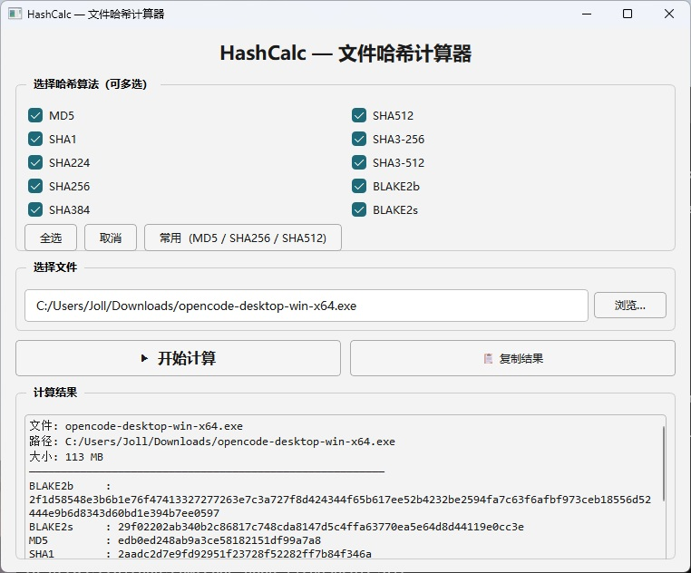

# HashCalc — 文件哈希计算器

- 懒得敲cmd命令，让AI弄得软件，主要适用WINDOWS平台，其他平台可能敲命令校验哈希都比打开软件快😄
- 一个基于 Python + PySide6 的图形化文件哈希计算工具，支持拖放操作、10 种哈希算法、多选并行计算。


## 功能

- **拖放加载**：将任意文件拖入窗口即可自动识别路径，拖拽时有半透明覆盖层提示
- **手动浏览**：点击「浏览…」按钮通过系统对话框选择文件
- **10 种哈希算法**：MD5, SHA1, SHA224, SHA256, SHA384, SHA512, SHA3-256, SHA3-512, BLAKE2b, BLAKE2s
- **多选并行计算**：可同时勾选多种算法，一次读取计算所有哈希值
- **后台线程**：使用 `QThread` 异步计算，大文件不阻塞 UI
- **实时进度条**：显示读取字节数，直观反馈计算过程
- **一键复制**：将全部结果复制到剪贴板

## 截图

> 拖放文件 → 勾选算法 → 点击「开始计算」→ 查看 / 复制结果

<p align="center">
  
</p>

---

## 安装 & 运行

### 依赖

- Python 3.10+
- PySide6

```bash
pip install PySide6
```

### 启动

```bash
python hash_calc.py
```

Windows 用户可双击 `run.bat` 启动。

### 打包为独立 exe

```bash
pip install pyinstaller
pyinstaller --onefile --windowed hash_calc.py
```

## 项目结构

```
hashcalc\
├── hash_calc.py      # 主程序
├── requirements.txt  # pip 依赖
├── run.bat           # Windows 快速启动脚本
├── screenshot.jpg    # 界面截图
└── README.md         # 本文件
```

## 技术栈

| 组件 | 说明 |
|------|------|
| GUI 框架 | PySide6 (Qt for Python) |
| 哈希计算 | Python `hashlib` 标准库 |
| 多线程 | `QThread` 后台计算 |
| 拖放 | Qt 原生 Drag & Drop, 全窗口覆盖层 |

## 开源协议

MIT License — 详见 [LICENSE](LICENSE)

## 致谢

本项目代码由 **DeepSeek V4** AI 助手辅助生成，连这个readme都是AI写的，用户太懒了！。详见 [DeepSeek 官方网站](https://chat.deepseek.com/)。
